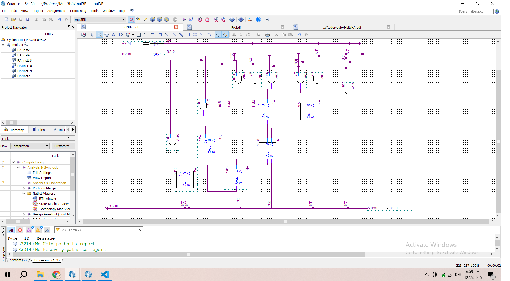
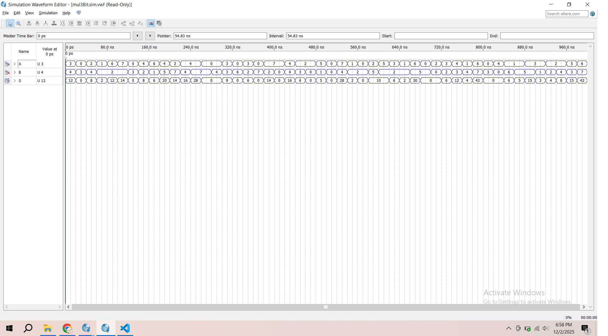

3-bit Multiplier on Quartus
📘 Giới thiệu

Dự án này triển khai bộ nhân 3-bit (3-bit binary multiplier) bằng cách thiết kế mạch số trên Intel Quartus. Bộ nhân nhận hai toán hạng 3 bit và tạo ra kết quả 6 bit.
Mạch được xây dựng từ các cổng logic cơ bản và các khối cộng mang nửa (Half Adder – HA) và cộng mang đầy đủ (Full Adder – FA).

🎯 Mục tiêu

Hiểu nguyên lý hoạt động của bộ nhân nhị phân dạng mạch tổ hợp (combinational circuit).

Thực hành thiết kế mạch trong Quartus.

Rèn luyện kỹ năng phân tích và tối ưu hóa sơ đồ mạch logic.
🧮 Nguyên lý hoạt động

Bộ nhân 3 bit gồm hai đầu vào:

A = A2 A1 A0

B = B2 B1 B0

Kết quả đầu ra:

P = P5 P4 P3 P2 P1 P0

Dựa trên phép nhân nhị phân, ta tạo các tích từng phần (partial products):
A2 A1 A0
×     B2 B1 B0
-----------------
      A2&B0  A1&B0  A0&B0
      A2&B1  A1&B1  A0&B1  (shift left 1)
A2&B2  A1&B2  A0&B2        (shift left 2)
-------------------------------
    → Cộng lại bằng HA và FA
🧱 Thành phần sử dụng

Dự án sử dụng các khối sau:

🔹 9 Cổng AND

Để tạo 9 tích từng phần:

A0×B0, A1×B0, A2×B0

A0×B1, A1×B1, A2×B1

A0×B2, A1×B2, A2×B2

🔹 3 Half Adder (HA)

Dùng trong các vị trí chỉ cần cộng 2 bit.

🔹 3 Full Adder (FA)

Dùng trong các vị trí cần cộng 3 bit (bao gồm cả carry).

🧩 Kiến trúc mạch

Sơ đồ logic (tóm tắt)

LSB: P0 = A0 AND B0

P1 nhận từ HA(A1B0 + A0B1)

Các bit cao hơn được tổng hợp bằng chuỗi HA và FA giống cấu trúc multiplier 3×3 tiêu chuẩn.

🛠️ Công cụ sử dụng

Intel Quartus Prime

Môi trường thiết kế mạch số

(Tuỳ chọn) Sử dụng Waveform Simulation để mô phỏng giá trị đầu vào – đầu ra.

📌 Kết quả

Bộ nhân hoạt động hoàn toàn bằng phần cứng (combinational logic), và tạo kết quả chính xác cho mọi tổ hợp hai số 3 bit (00–07).